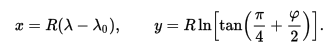
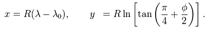
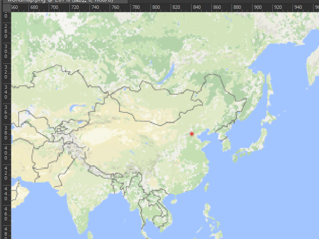

#An accurate algorithm to convert lat/lon into a 2d point.
----

The choice of the function y(φ) for the Mercator projection is determined by the demand that the projection be conformal, a condition which can be defined in two equivalent ways:

- Equality of angles. The condition that a sailing course of constant azimuth α on the globe is mapped into a constant grid bearing β on the map. Setting α = β in the above equations gives y′(φ) = R sec φ.
- Isotropy of scale factors. This is the statement that the point scale factor is independent of direction so that small shapes are preserved by the projection. Setting h = k in the above equations again gives y′(φ) = R sec φ.

with y(0) = 0, by using integral tablesor elementary methods, gives y(φ). Therefore,

In the first equation λ0 is the longitude of an arbitrary central meridian usually, but not always, that of Greenwich (i.e., zero). The difference (λ − λ0) is in radians.

The function y(φ) is plotted alongside φ for the case R = 1: it tends to infinity at the poles. The linear y-axis values are not usually shown on printed maps; instead some maps show the non-linear scale of latitude values on the right. More often than not the maps show only a graticule of selected meridians and parallels.

The formulas to derive projected Easting and Northing coordinates from spherical latitude φ and longitude λ are:

    E = FE + R (λ – λₒ)
    N = FN + R ln[tan(π/4 + φ/2)]   

FE (false easting)
FN (false northing)
λO is the longitude of natural origin.

####Actually in spherical Mercator they are not used.

###It is quite accurate!Amazing!

